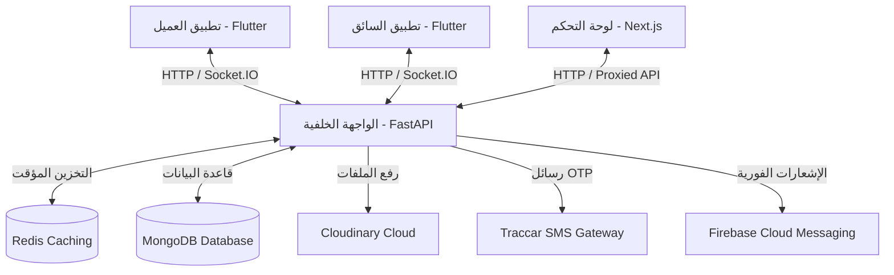

# منصة تسهيلا (Tashila): تقرير الجاهزية وخطوات النشر

يقيم هذا التقرير الحالة التطويرية الحالية لمنصة شحن ونقل الخدمات اللوجستية **تسهيلا (Tashila)**، مع تحديد الميزات المكتملة، المكونات الناقصة، الثغرات الأمنية وإعدادات التطوير التي تتطلب تصحيحاً، بالإضافة إلى تفصيل الخطوات المطلوبة لنشر التطبيقات على متجري Google Play و Apple App Store.

---

## 1. ملخص تنفيذي ونظرة عامة على البنية البرمجية

منصة **تسهيلا** هي منصة متخصصة في خدمات النقل والشحن والخدمات اللوجستية مصممة لسيارات النقل والشاحنات (مثل شاحنات الكابينة الفردية والكابينة المزدوجة) في الجزائر والمنطقة المحيطة بها. يدعم النظام اللغات **العربية (كلغة افتراضية)**، **الفرنسية**، و**الإنجليزية**.

يتكون النظام من أربعة مشاريع فرعية واضحة:
1. **الواجهة الخلفية (Tashila API)**: واجهة برمجة تطبيقات ويب جاهزة للإنتاج مبنية باستخدام FastAPI (Python 3.12)، وتعتمد على قاعدة بيانات MongoDB لتخزين البيانات، ونظام Redis للتخزين المؤقت وإدارة العمليات الفورية، بالإضافة إلى Socket.IO للتواصل الفوري عبر بروتوكول WebSocket.
2. **تطبيق العميل (Tashila Client)**: تطبيق محمول مبني بإطار عمل Flutter مخصص للعملاء لطلب الرحلات، وتقدير الأسعار، وتتبع السائقين مباشرة على الخريطة.
3. **تطبيق السائق (Tashila Driver)**: تطبيق محمول مبني بإطار عمل Flutter مخصص للسائقين لتسجيل شاحناتهم، ورفع مستندات الهوية والتحقق، وإدارة حالتهم (نشط/غير نشط)، وتلقي عروض الرحلات الفورية، ومتابعة الأرباح.
4. **لوحة تحكم المسؤول (Tashila Admin)**: تطبيق ويب مبني بإطار عمل Next.js (TypeScript) يتيح لمديري المنصة التحكم الكامل في قبول السائقين وتوثيقهم، وإدارة المستخدمين، ومتابعة الرحلات الجارية والسابقة، وعرض مواقع السائقين الفورية على الخريطة، وإدارة إعدادات التسعير.



---

## 2. تدقيق الميزات المكتملة

### أ. الواجهة الخلفية (Tashila API Backend)
*   **التوثيق والأمان**: تطبيق نظام التوثيق الكامل بالاعتماد على رموز JWT الثنائية (رمز الوصول + رمز التحديث) مع آلية لإدراج الرموز الملغاة في القائمة السوداء عند تسجيل الخروج باستخدام Redis.
*   **خدمة التحقق برقم الهاتف (OTP)**: توليد والتحقق من رموز OTP الفورية عبر بوابة الرسائل القصيرة Traccar SMS، مع تفعيل نظام تقييد الطلبات (Rate Limiting) لمنع الهجمات المزعجة.
*   **نظام توزيع الرحلات المتتالي**: محرك توزيع ذكي شبيه بنظام Uber. عند طلب العميل رحلة، يقوم النظام بتجميع السائقين القريبين المتصلين والمقبولين في نطاق 50 كم باستخدام إحداثيات الجغرافيا في MongoDB، ثم يعرض الرحلة على السائقين واحداً تلو الآخر بنظام حصري مؤقت مدعوم بـ Redis لمنع التضارب.
*   **تحديثات الموقع الفورية**: استقبال إرساليات الموقع الجغرافي الفوري للسائقين وتخزينها مؤقتاً في Redis لتقليل الضغط على قاعدة البيانات الأساسية.
*   **نظام رفع الملفات**: مهيأ لدعم الرفع السحابي على منصة Cloudinary CDN كخيار أساسي للإنتاج، مع خيار الرفع المحلي كبديل مؤقت.
*   **إشعارات Firebase (FCM)**: ربط كامل لإرسال إشعارات فورية عن حالة الرحلة (طلب رحلة جديدة، قبول الطلب، إشعار قبول السائق، أو إشعار رفض الوثائق).
*   **حساب الأسعار الديناميكي**: نظام حساب التكلفة بناءً على السعر الأساسي، سعر الكيلومتر، وقت الرحلة، والرسوم الإضافية لنوع الشاحنة (كابينة فردية أو مزدوجة).

### ب. تطبيق العميل (Tashila Client App)
*   **دعم متعدد اللغات**: تعريب كامل للواجهة إلى العربية (`ar`)، الفرنسية (`fr`)، والإنجليزية (`en`) مع ضبط التنسيقات المحلية.
*   **نظام تسجيل الدخول**: شاشة التسجيل برقم الهاتف مع إدماج خاصية القراءة التلقائية لرسائل التحقق (`sms_autofill`).
*   **نظام حجز تفاعلي**: واجهة خرائط Google تتيح للمستخدمين تحديد نقطة الانطلاق والوصول، وعرض مسار الرحلة، والاطلاع على تقدير التكلفة الفوري، واختيار نوع الشاحنة.
*   **دورة حياة الرحلة**: واجهات تدير جميع مراحل الطلب: `البحث عن سائق` ➔ `السائق في الطريق` (مع تتبع مباشر) ➔ `بدء الرحلة` ➔ `بانتظار الدفع` ➔ `ملخص الرحلة وتقييم السائق`.
*   **التقييم والملاحظات**: تقييم السائق بالنجوم مع إمكانية تحديد ميزات إيجابية أو سلبية وكتابة تعليق.
*   **سجل الرحلات**: عرض تفصيلي لجميع الرحلات السابقة (التاريخ، المسار، السعر، اسم السائق، أو أسباب الإلغاء).

### ج. تطبيق السائق (Tashila Driver App)
*   **إعداد الملف الشخصي متعدد المراحل**: معالج تسجيل لبيانات السائق يتضمن رفع الوثائق المطلوبة للتوثيق:
    1. رخصة السياقة (`drivingLicense`)
    2. البطاقة الرمادية / شهادة تسجيل المركبة (`vehicleRegistration`)
    3. صورة الشاحنة (`vehiclePhoto`)
*   **زر الاتصال والتوفر**: مفتاح للتحويل بين وضع الاتصال/عدم الاتصال (لا يسمح للسائق بالاتصال بالمنصة إلا بعد مراجعة وقبول وثائقه من الإدارة).
*   **تلقي الطلبات الحصري**: استقبال طلبات الرحلات بشكل فوري مع مؤقت تنازلي وإصدار أصوات تنبيهية واهتزازات.
*   **إدارة مراحل الرحلة**: أزرار تحكم لتحديث الحالة: *التوجه للعميل* ➔ *الوصول لنقطة الركوب* ➔ *بدء الرحلة* ➔ *إكمال الرحلة وتوصيل الشحنة*.
*   **الأرباح والإحصائيات**: شاشات لعرض رسوم الأرباح اليومية، الأسبوعية والشهرية، وعدد الساعات النشطة والرحلات المنجزة.

### د. لوحة تحكم المسؤول (Tashila Admin Dashboard)
*   **لوحة المؤشرات العامة (KPI)**: إحصائيات فورية للمنصة تشمل إجمالي الأرباح، عدد السائقين المتصلين، الرحلات الناجحة، ونسبة نجاح العمليات.
*   **خريطة العمليات المباشرة**: خريطة تعرض السائقين المتصلين ونشاطهم ومواقعهم الجغرافية في الوقت الفعلي.
*   **توثيق وقبول السائقين**: مراجعة السائقين المسجلين الجدد، والاطلاع على المستندات والملفات المرفوعة، والموافقة عليها أو رفضها مع كتابة سبب الرفض.
*   **مراقبة الرحلات**: سجل بكافة الرحلات وتفاصيلها وحالتها مع ميزات الفلترة والبحث.
*   **إعدادات النظام**: إمكانية تعديل معايير التسعير والتعريفات لكل كيلومتر ونوع شاحنة بشكل فوري من لوحة التحكم.

---

## 3. الفجوات والميزات المطلوبة (ما يجب عمله قبل الإطلاق)

لكي تكون المنصة جاهزة تجارياً بشكل كامل، يوصى بالعمل على الميزات التالية:

1.  **نظام الدردشة والاتصال الداخلي**: لا يوجد حالياً نظام دردشة نصي مدمج بين العميل والسائق. يعتمد التطبيق حالياً على استدعاء برنامج الاتصال الهاتفي الخارجي عبر [url_launcher](file:///c:/Users/sidoa/Downloads/tashila-source/tashila/tashila_client/pubspec.yaml#L55). يُنصح ببناء نظام دردشة داخلي باستخدام Socket.IO.
2.  **بوابة الدفع الإلكتروني**: التطبيق حالياً مصمم للدفع نقداً عند التوصيل. لتفعيل الدفع الإلكتروني، يجب دمج بوابة دفع جزائرية (مثل **Chargily** أو **بريديباي / Baridimob**) في الواجهة الخلفية وفي التطبيقات.
3.  **تتبع الموقع في الخلفية (Background Location) للسائق**: لضمان استمرار إرسال إحداثيات السائق بدقة وتحديث موقعه للعميل حتى لو قام بقفل هاتفه أو فتح تطبيق ملاحة آخر (مثل Google Maps). يعتمد التطبيق حالياً على حزمة [geolocator](file:///c:/Users/sidoa/Downloads/tashila-source/tashila/tashila_driver/pubspec.yaml#L46) التي تعمل أساساً في الواجهة الفورية. يُوصى بالاعتماد على مكتبة متقدمة مثل `flutter_background_geolocation`.
4.  **الملاحة والتوجيه المباشر للسائق**: لا يعرض تطبيق السائق إرشادات الملاحة خطوة بخطوة (Turn-by-turn). يوصى بإضافة زر لتوجيه السائق وفتح التطبيقات الجغرافية الخارجية (Google Maps أو Waze) مع تمرير إحداثيات الوصول تلقائياً.

---

## 4. المخاطر الأمنية الحرجة ومشاكل الإعدادات (يجب تصحيحها فوراً)

قبل البدء في استخراج نسخ الإنتاج النهائية ورفعها على المتاجر، يجب تصحيح المشاكل التالية:

### ⚠️ تفعيل نظام تجاوز رمز OTP للاختبار في البيئة الحية
في ملف [auth_service.py](file:///c:/Users/sidoa/Downloads/tashila-source/tashila/tashila-api/app/services/auth_service.py#L30-L36)، تم ضبط المتغير `_TEST_OTP_ENABLED` على القيمة `True` مع تثبيت الرمز التجريبي `111111`.
> [!IMPORTANT]
> يجب تغيير هذا المتغير إلى `False` عند النشر للإنتاج لضمان توليد رموز حقيقية وآمنة، وتجنب السماح لأي شخص بالدخول لأي حساب بمجرد كتابة الرمز التجريبي `111111`. يجب أيضاً إدخال بيانات بوابة الرسائل القصيرة Traccar في متغيرات البيئة.

### ⚠️ حفظ الملفات المرفوعة بشكل مؤقت غير مستقر
الواجهة الخلفية مبرمجة في ملف [config.py](file:///c:/Users/sidoa/Downloads/tashila-source/tashila/tashila-api/app/core/config.py#L27-L28) على رفع الملفات لمجلد محلي مؤقت `/tmp/tashila_uploads` عند عدم تهيئة متغير `cloudinary_url`.
> [!WARNING]
> في بيئات الاستضافة الحديثة (مثل Railway)، تكون الأقراص مؤقتة ويعاد تصفيرها مع كل إعادة تشغيل للخادم (Deploy/Restart). هذا يعني أن صور وثائق السائقين ورخص السياقة ستضيع وتُحذف بشكل عشوائي. يجب استخدام خدمة تخزين سحابي مثل Cloudinary وتفعيلها بشكل صحيح.

### ⚠️ معرف الحزمة الافتراضي (com.example) على iOS
معرف حزمة تطبيق السائق لنظام iOS معرف كـ `com.example.tashilaDriver` في ملف [project.pbxproj](file:///c:/Users/sidoa/Downloads/tashila-source/tashila/tashila_driver/ios/Runner.xcodeproj/project.pbxproj#L499).
> [!CAUTION]
> ترفض شركة Apple بشكل قاطع أي تطبيق يحتوي على معرف يبدأ بـ `com.example`. يجب تغييره لمعرف فريد يطابق نطاق عملك (مثال: `com.tashila.driver`).

### ⚠️ استخدام شهادات التصحيح (Debug Keys) للنسخ النهائية على Android
كلا التطبيقين في ملفات [build.gradle.kts](file:///c:/Users/sidoa/Downloads/tashila-source/tashila/tashila_client/android/app/build.gradle.kts#L37) يقومان بالتوقيع النهائي للنسخ باستخدام مفتاح التصحيح الافتراضي:
`signingConfig = signingConfigs.getByName("debug")`
> [!WARNING]
> سيرفض متجر Google Play رفع أي حزمة تطبيق موقعة بمفتاح تجريبي (Debug Key). يجب إنشاء ملف توقيع حقيقي للإنتاج وربطه في إعدادات بناء Gradle.

### ⚠️ مفاتيح خرائط Google التجريبية والمكشوفة
المفاتيح الخاصة بالخرائط مكتوبة بشكل مباشر داخل ملفات البرمجة [MapConfig](file:///c:/Users/sidoa/Downloads/tashila-source/tashila/tashila_client/lib/core/config/map_config.dart#L7-L8) وفي ملفات المانيفست.
> [!TIP]
> يوصى باستبدال هذه المفاتيح بمفاتيح رسمية خاصة بالمنصة من حساب Google Cloud الخاص بك، مع تفعيل الفوترة وربط القيود الجغرافية على المعرفات لضمان عدم سرقة المفاتيح أو استخدامها خارج التطبيق.

---

## 5. خطوات النشر على متجر Google Play (Android)

لنشر تطبيقي العميل والسائق على متجر Google Play، اتبع الخطوات التالية لكل تطبيق:

### الخطوة 1: تغيير معرف الحزمة (Package Name)
قم بتغيير معرف التطبيق ليتطابق مع هويتك التجارية (مثال: من `com.tashila.tashila_client` إلى `com.tashila.client`):
1. في ملف `android/app/build.gradle.kts` قم بتحديث قيم `namespace` و `applicationId`.
2. قم بتحديث مسارات المجلدات في `android/app/src/main/kotlin/` لتتطابق مع المعرف الجديد.
3. قم بتعديل سطر اسم الحزمة في ملف `MainActivity.kt`.

### الخطوة 2: إنشاء مفتاح التوقيع النهائي (Keystore)
افتح سطر الأوامر ونفذ الأمر التالي لإنشاء ملف التوقيع الخاص بنظام أندرويد:
```bash
keytool -genkey -v -keystore C:\Users\sidoa\tashila-release-key.jks -keyalg RSA -keysize 2048 -validity 10000 -alias tashila
```
احتفظ بملف التوقيع وكلمة المرور في مكان آمن للغاية، حيث لن تتمكن من تحديث تطبيقاتك مستقبلاً في حال فقدانه.

### الخطوة 3: إعداد التوقيع التلقائي في تطبيق Flutter
1. قم بإنشاء ملف باسم `key.properties` في مجلد `android/` داخل مشروعك وضَع فيه البيانات التالية:
   ```properties
   storePassword=your_keystore_password
   keyPassword=your_key_password
   keyAlias=tashila
   storeFile=C:/Users/sidoa/tashila-release-key.jks
   ```
2. قم بتعديل ملف `android/app/build.gradle.kts` ليتعرف على ملف الخصائص تلقائياً ويستخدمه عند البناء النهائي:
   ```kotlin
   val keystoreProperties = Properties()
   val keystorePropertiesFile = rootProject.file("key.properties")
   if (keystorePropertiesFile.exists()) {
       keystoreProperties.load(FileInputStream(keystorePropertiesFile))
   }

   android {
       signingConfigs {
           create("release") {
               keyAlias = keystoreProperties["keyAlias"] as String
               keyPassword = keystoreProperties["keyPassword"] as String
               storeFile = file(keystoreProperties["storeFile"] as String)
               storePassword = keystoreProperties["storePassword"] as String
           }
       }
       buildTypes {
           release {
               signingConfig = signingConfigs.getByName("release")
           }
       }
   }
   ```

### الخطوة 4: إعداد مفاتيح خرائط Google للإنتاج
1. افتح **مكتبة Google Cloud Console**، أنشئ مشروعاً وقم بتفعيل **Maps SDK for Android**.
2. أنشئ مفتاح API جديد وقم بتقييده باستخدام:
   - معرف الحزمة الخاص بتطبيقك (`com.tashila.client`).
   - بصمة SHA-1 الخاصة بملف التوقيع الذي أنشأته (يمكن استخراج البصمة عبر الأمر `keytool -list -v -keystore path/to/keystore`).
3. استبدل المفتاح في:
   - ملف `android/app/src/main/AndroidManifest.xml` (في وسم الميتاداتا `com.google.android.geo.API_KEY`).
   - ملف `lib/core/config/map_config.dart`.

### الخطوة 5: استخراج الحزمة النهائية (App Bundle - AAB)
من مجلد المشروع الأساسي، قم بتنفيذ الأمر التالي للبناء:
```bash
flutter build appbundle --release
```
سينتج عن هذا ملف التثبيت المعتمد للمتجر في المسار: `build/app/outputs/bundle/release/app-release.aab`.

### الخطوة 6: الرفع والنشر في لوحة مطوري Google Play
1. سجل حساب مطور في [Google Play Console](https://play.google.com/console/) (رسوم تسجيل تدفع لمرة واحدة بقيمة 25 دولار).
2. اضغط على **Create app** واملأ البيانات الأساسية (اسم التطبيق، اللغة الافتراضية، إلخ).
3. أكمل متطلبات **محتوى التطبيق (App Content)** (سياسة الخصوصية، الفئة المستهدفة، تصنيف العمر، إعلانات البيانات والأمان).
4. اذهب إلى قائمة **Production** أو **Closed Testing**.
5. ارفع ملف الـ `.aab` المستخرج.
6. أرسل التطبيق للمراجعة. (ملاحظة: تتطلب حسابات المطورين الشخصية الجديدة إجراء اختبار مغلق بـ 20 مختبراً على الأقل لمدة 14 يوماً قبل التمكن من طرح التطبيق للعامة).

---

## 6. خطوات النشر على متجر Apple App Store (iOS)

يتطلب إعداد وبناء نسخة iOS وجود جهاز ماك (macOS) وبرنامج Xcode منصب عليه.

### الخطوة 1: تغيير معرف الحزمة (Bundle Identifier)
1. افتح مشروع iOS باستخدام Xcode عن طريق فتح الملف `ios/Runner.xcworkspace`.
2. اضغط على مشروع `Runner` في القائمة الجانبية اليسرى، ثم اختر التبويب **General**.
3. في قسم **Identity**، قم بتعديل حقل **Bundle Identifier** (مثال: من `com.example.tashilaDriver` إلى `com.tashila.driver`).

### الخطوة 2: تسجيل المعرف وإعداد حساب مطوري Apple
1. اشترك في **برنامج مطوري Apple** [Apple Developer Program](https://developer.apple.com/programs/) (رسوم سنوية 99 دولار).
2. ادخل للوحة التحكم الخاصة بالمطورين، واذهب إلى **Identifiers** وقم بتسجيل معرف الحزمة الخاص بالتطبيقات.
3. قم بتفعيل الخصائص والصلاحيات اللازمة (مثل الإشعارات الفورية Push Notifications وتحديثات الموقع الجغرافي بالخلفية).

### الخطوة 3: إعداد مفاتيح خرائط Google لنظام iOS
1. من لوحة تحكم مطوري Google Cloud، قم بتفعيل مكتبة **Maps SDK for iOS**.
2. أنشئ مفتاح API مخصص وقيد استخدامه على معرف حزمة نظام iOS الخاص بتطبيقك.
3. افتح ملف `ios/Runner/Info.plist` في المشروع وقم بتحديث حقل `GMSApiKey`:
   ```xml
   <key>GMSApiKey</key>
   <string>YOUR_PRODUCTION_IOS_MAPS_KEY</string>
   ```
4. تأكد من إعداد ملف `MapConfig` في مشروع Flutter ليمرر هذا المفتاح تلقائياً عند تشغيل التطبيق على نظام iOS.

### الخطوة 4: توثيق أسباب صلاحيات الوصول
يتشدد مراجعو متجر Apple في أسباب طلب الصلاحيات. تأكد من أن النصوص في ملف `Info.plist` واضحة وتشرح الفائدة للعميل (باللغات العربية والفرنسية والإنجليزية):
*   `NSLocationWhenInUseUsageDescription`: "يتم استخدام الموقع لتحديد نقاط الانطلاق والوصول للرحلات."
*   `NSLocationAlwaysAndWhenInUseUsageDescription`: "يتم استخدام موقعك الجغرافي لعرض سيارات النقل والسائقين على الخريطة بشكل دقيق."
*   `NSPhotoLibraryUsageDescription`: "نحتاج للوصول لمعرض الصور لمساعدتك على رفع المستندات وصورة حسابك الشخصي."
*   `NSCameraUsageDescription`: "نحتاج لاستخدام الكاميرا لتصوير مستندات تسجيل الشاحنة ورخصة السياقة لتفعيل حسابك."

### الخطوة 5: إنشاء النسخة ورفعها (Archive)
1. في برنامج Xcode، حدد الجهاز المستهدف كـ **Any iOS Device (arm64)**.
2. اذهب إلى القائمة العلوية: **Product** ➔ **Clean Build Folder**.
3. اذهب إلى: **Product** ➔ **Archive**.
4. بعد انتهاء العملية بنجاح، تفتح نافذة المنظم (Organizer). اضغط على زر **Distribute App**.
5. اختر **App Store Connect** ثم **Upload**. سيتكفل برنامج Xcode بإنشاء شهادات التوقيع التلقائية ورفع التطبيق إلى حسابك.

### الخطوة 6: التقديم النهائي للمراجعة في App Store Connect
1. سجل الدخول إلى [App Store Connect](https://appstoreconnect.apple.com/).
2. أنشئ تطبيقاً جديداً واربطه بمعرف الحزمة المسجل.
3. املأ البيانات التسويقية للمتجر (وصف التطبيق، الكلمات الدلالية، لقطات شاشة بمقاسات 6.7 إنش و5.5 إنش للآيفون، رابط الدعم وسياسة الخصوصية).
4. وفّر بيانات دخول تجريبية (رقم هاتف تجريبي ورمز التحقق لحساب عميل وحساب سائق) لكي يتمكن مراجعو Apple من تسجيل الدخول وفحص ميزات التطبيق.
5. أرسل التطبيق للمراجعة والاعتماد النهائي للمتجر.

---

## 7. قائمة المراجعة النهائية قبل الإطلاق (Pre-Flight Checklist)

تأكد من إكمال جميع النقاط التالية قبل تسليم النسخ النهائية للنشر:

| مرحلة العمل | المهمة المطلوبة | الحالة الحالية | الملف المرجعي |
| :--- | :--- | :---: | :--- |
| **الواجهة الخلفية** | إيقاف وضع التجاوز التجريبي لرمز الـ OTP (`_TEST_OTP_ENABLED = False`) | ❌ معلق | [auth_service.py](file:///c:/Users/sidoa/Downloads/tashila-source/tashila/tashila-api/app/services/auth_service.py#L34) |
| **الواجهة الخلفية** | تفعيل وتهيئة حساب Cloudinary لحفظ الملفات بشكل مستقر | ❌ معلق | [config.py](file:///c:/Users/sidoa/Downloads/tashila-source/tashila/tashila-api/app/core/config.py#L28) |
| **الواجهة الخلفية** | ضبط متغيرات بيئة الإنتاج لقاعدة البيانات وRedis | ❌ معلق | ملف إعدادات البيئة `.env` |
| **الواجهة الخلفية** | إدخال وتفعيل مفتاح خادم إشعارات Firebase (FCM Key) للإنتاج | ❌ معلق | [config.py](file:///c:/Users/sidoa/Downloads/tashila-source/tashila/tashila-api/app/core/config.py#L23) |
| **تطبيق السائق** | تغيير اسم المعرف الافتراضي في Xcode (تغيير `com.example`) | ❌ معلق | [project.pbxproj](file:///c:/Users/sidoa/Downloads/tashila-source/tashila/tashila_driver/ios/Runner.xcodeproj/project.pbxproj#L499) |
| **تطبيقات أندرويد** | إنشاء ملفات توقيع حقيقية (Keystore) وضبطها في ملفات Gradle | ❌ معلق | ملفات `key.properties` |
| **تطبيقات أندرويد** | استبدال مفاتيح خرائط Google في ملفات Manifest و MapConfig للإنتاج | ❌ معلق | ملفات المانيفست وخرائط Google |
| **تطبيقات iOS** | حجز حساب Apple المطور وتوليد شهادات النشر والتوثيق | ❌ معلق | حساب Apple Developer |
| **لوحة المتاجر** | تصميم الصور التسويقية وكتابة نصوص المتجر باللغات الثلاث (AR/FR/EN) | ❌ معلق | الموارد التسويقية |
